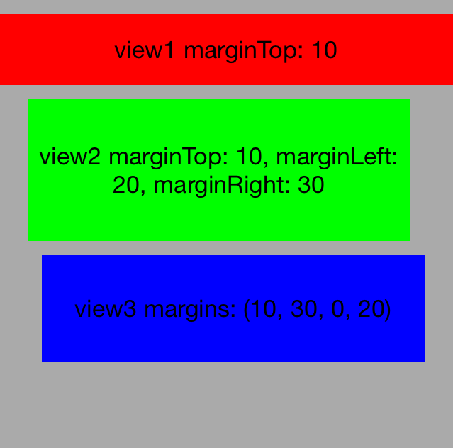
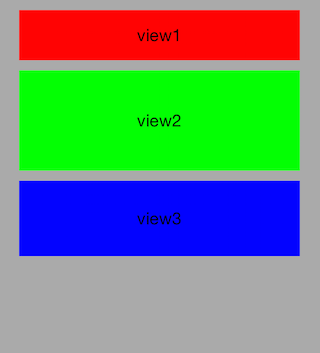
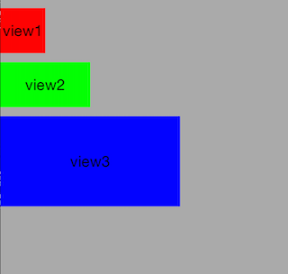
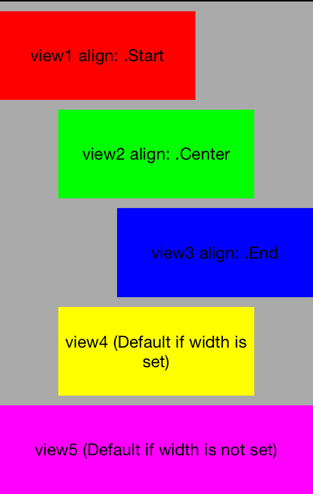
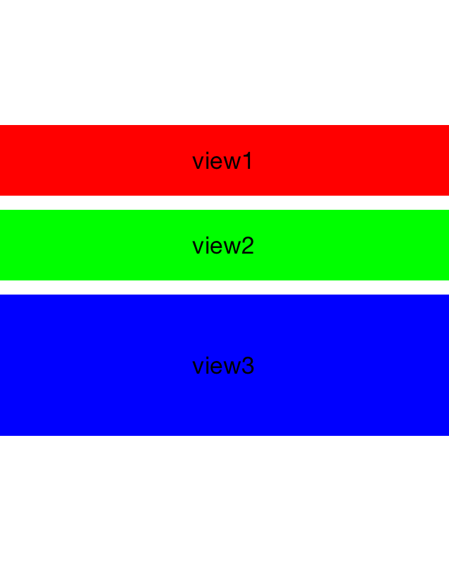
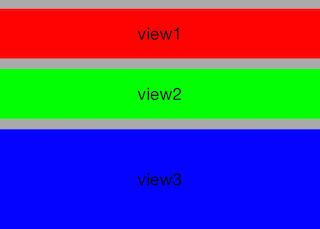
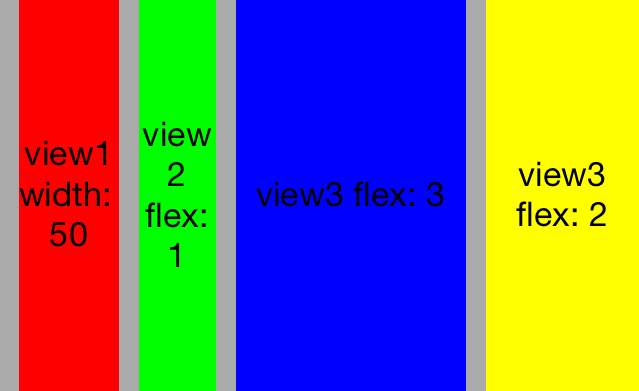
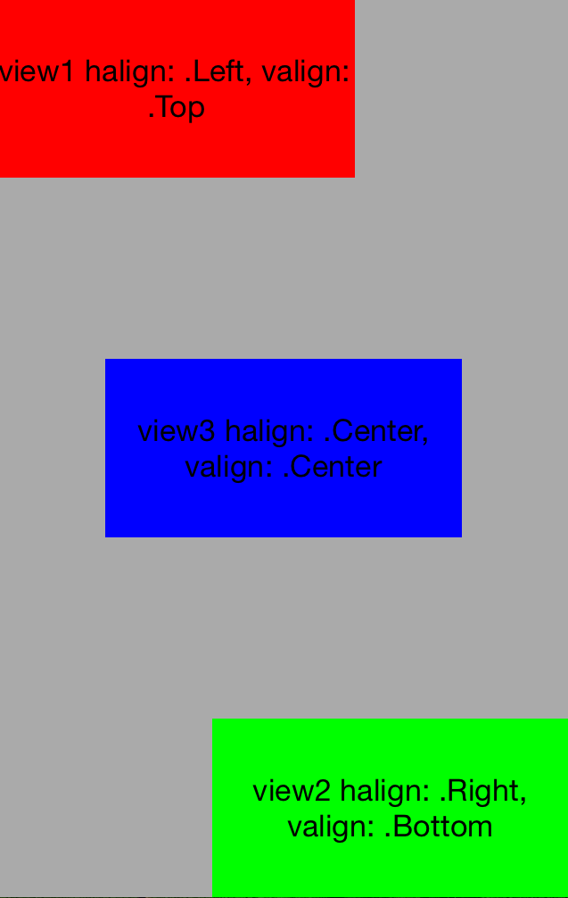
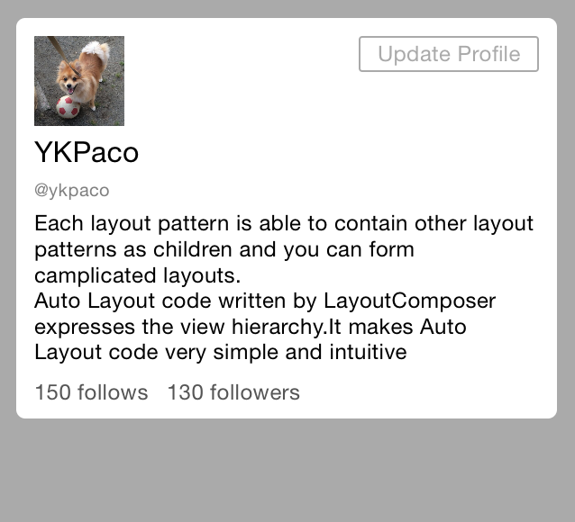

# LayoutComposer

[](https://travis-ci.org/Yusuke Kawakami/LayoutComposer)
[](http://cocoapods.org/pods/LayoutComposer)
[](http://cocoapods.org/pods/LayoutComposer)
[](http://cocoapods.org/pods/LayoutComposer)


LayoutComposer provides methods to write the typical UIView layout patterns such as:

* place UIViews along the vertical/horizontal axis. (VBox/HBox Layout)
* place child UIViews at the top|bottom|left|right|center of the parent UIView. (Relative Layout)
* make a child UIView fit the size of its parent view. (Fit Layout)

Since each layout pattern is able to contain other layout patterns as child components, you can form complicated layouts.
Auto Layout code written by LayoutComposer expresses the UIView hierarchy.
It makes Auto Layout code very simple and intuitive.


## Usage

### Basic


```swift
let contentView: UIView = ...
let view1 = UIView()
let view2 = UIView()
let view3 = UIView()

contentView.applyLayout(VBox(), items: [
    $(view1, height: 50),
    $(view2, height: 100),
    $(view3, height: 75)
])
```


LayoutComposer extends UIView to add `applyLayout` method.
`applyLayout` adds UIViews as children by the specified layout.
In the above example, `contentView` adds view1, view2 and view3 as child views and lays out them by `VBox` layout.

First parameter of the method is a instance of the `Layout` class, and `items` parameter is an array of `LayoutComponent`.
LayoutComponent is created by  `$(view, options...)` expression. In the above example, LayoutComponents of
view1, view2 and view3 are created with the `height` option.


### VBox Layout


```swift
contentView.applyLayout(VBox(), items: [
    $(view1, height: 50),
    $(view2, height: 100),
    $(view3, flex: 1),
    $(view4, flex: 2)
])
```

`VBox` places UIViews along the vertical axis. Each LayoutComponent can specify height in pixel or by using `flex` option.
The flex option set height of the LayoutComponent relative to each view having `flex` option.
LayoutComponents having the flex option divide the available area.
If neither height or flex is specified, the intrinsic content size of the view is used.


#### Margins



```swift
contentView.applyLayout(VBox(), items: [
    $(view1, height: 50, marginTop: 10),
    $(view2, height: 100, marginTop: 10, marginLeft: 20, marginRight: 30),
    $(view3, height: 75, margins: (10, 30, 0, 20))
])
```

In VBox/HBox layout, margins of each LayoutComponent can be set by
`margingTop`, `marginBottom`, `marginLeft`, `marginRight` options.
`margins` option is also available for setting margins by tuple.




```swift
contentView.applyLayout(VBox(defaultMargins: (10, 20, 0, 20)), items: [
    $(view1, height: 50),
    $(view2, height: 100),
    $(view3, height: 75)
])
```

`defaultMargins` is also available for setting default margins of each LayoutComponent.


#### Alignment



```swift
contentView.applyLayout(VBox(defaultMargins: (10, 0, 0, 0), align: .Start), items: [
    $(view1, width: 50, height: 50),
    $(view2, width: 100, height: 50),
    $(view3, width: 200, height: 100)
])
```

VBox can have `align` parameters. LayoutComponents are left-aligned in the container if `.Start` is set,
right-aligned if `.End` is set, and center-aligned if `.Center` is set.
If align is set to `.Stretch`, the widths of LayoutComponents are expanded to the width of the parent view.
The default alignment is `.Stretch`.




```swift
contentView.applyLayout(VBox(defaultMargins: (10, 0, 0, 0)), items: [
    $(view1, width: 200, flex: 1, align: .Start),
    $(view2, width: 200, flex: 1, align: .Center),
    $(view3, width: 200, flex: 1, align: .End),
    $(view4, width: 200, flex: 1),
    $(view5, flex: 1),
])
```

Alignment can be set individually by setting align option to each LayoutComponent.


#### Pack



```swift
container.applyLayout(VBox(defaultMargins: (10, 0, 0, 0), pack: .Center), items: [
    $(view1, height: 50),
    $(view2, height: 50),
    $(view3, height: 100)
])
```

VBox can have `pack` parameters. LayoutComponents are top-aligned in the container if `.Start` is set,
bottom-aligned if `.End` is set, and center-aligned if `.Center` is set.




```swift
container.applyLayout(VBox(defaultMargins: (10, 0, 0, 0), pack: .Fit), items: [
    $(view1, height: 50),
    $(view2, height: 50),
    $(view3, height: 100)
])
```

If pack option is set to `.Fit`, the height of the parent view is adjusted to fit the child views.


### HBox Layout



```swift
contentView.applyLayout(HBox(defaultMargins: (0, 10, 0, 0)), items: [
    $(view1, width: 50),
    $(view2, flex: 1),
    $(view3, flex: 3),
    $(view4, flex: 2)
])
```

`HBox` places UIViews along the horizontal axis.
HBox is the horizontal version of VBox.


### Relative Layout



```swift
contentView.applyLayout(Relative(), items: [
   $(view1, halign: .Left, valign: .Top, width: 200, height: 100),
   $(view2, halign: .Right, valign: .Bottom, width: 200, height: 100),
   $(view3, halign: .Center, valign: .Center, width: 200, height: 100)
])
```

`Relative` layout places child components at the top, bottom, left, right or center of the parent view.
`halign` and `valign` options are available for setting alignments for each LayoutComponent.

Similar to VBox/HBox layout, `margingTop`, `marginBottom`, `marginLeft`, `marginRight`, and `margins` options are available for setting margins.


### Fit Layout

```swift
contentView.applyLayout(Fit(), item: $(view1))
```

`Fit` makes a child component fit the size of its parent view.

Similar to VBox/HBox layout, `margingTop`, `marginBottom`, `marginLeft`, `marginRight`, and `margins` options are available for setting margins.


### Nest Layouts

You can form more complicated layouts by nesting multiple layout patterns.



```swift
let profileContainer = UIView()
...
let icon = UIImageView(image: UIImage(named: "avatar.jpeg"))
...
let changeProfileBtn = UIButton.buttonWithType(.System) as! UIButton
changeProfileBtn.setTitle("Update Profile", forState: .Normal)
...
let nameLabel = UILabel()
nameLabel.text = "YKPaco"
...
let userIDLabel = UILabel()
userIDLabel.text = "@ykpaco"
...
let messageLabel = UILabel()
messageLabel.text = "Each layout pattern is able to contain other layout patterns ..."
...
let followLabel = UILabel()
followLabel.text = "150 follows"
...
let followerLabel = UILabel()
followerLabel.text = "130 followers"

contentView.applyLayout(VBox(), items: [
    $(profileContainer, margins: (10, 10, 10, 10), layout: VBox(pack: .Fit, defaultMargins: (0, 10, 0, 10)), items: [
        $(nil, height: 50, marginTop: 10, layout: Relative(), items: [
            $(icon, width: 50, height: 50, halign: .Left),
            $(changeProfileBtn, width: 100, height: 20, halign: .Right, valign: .Top)
        ]),
        $(nameLabel, marginTop: 5),
        $(userIDLabel, marginTop: 5),
        $(messageLabel, marginTop: 5),
        $(nil, height: 30, layout: HBox(), items: [
            $(followLabel),
            $(followerLabel, marginLeft: 10)
        ])
    ])
])
```

Each LayoutComponent is able to have `layout` option to make it a container of other LayoutComponents.
`$(nil, ...)` creates a new transparent UIView. It is convenient method to create a new container.


## Installation

### Using [CocoaPods](http://cocoapods.org)

LayoutComposer is available through [CocoaPods](http://cocoapods.org).
To install it, simply add the following line to your Podfile:

```ruby
pod "LayoutComposer"
```

### Manually from GitHub

1. Download the source files in the Pod/Classes.
1. Add the source files to your Xcode project.


## Requirements

The current release of LayoutComposer supports the following versions of iOS

* Xcode
  * Language Support: **Swift** *(1.2)*
* iOS
  * Fully Compatible With: **iOS 8.X**
  * Minimum Deployment Target: **iOS 7.0**
    * If you set the deployment target iOS 7.X, installation through CocoaPods is not available. You have to install LayoutComposer manually.


## Samples

To run the example project, clone the repo, and run `pod install` from the Example directory first.


## Author

Yusuke Kawakami, kawakami.paco.yusuke@gmail.com


## License

LayoutComposer is available under the MIT license. See the LICENSE file for more info.
